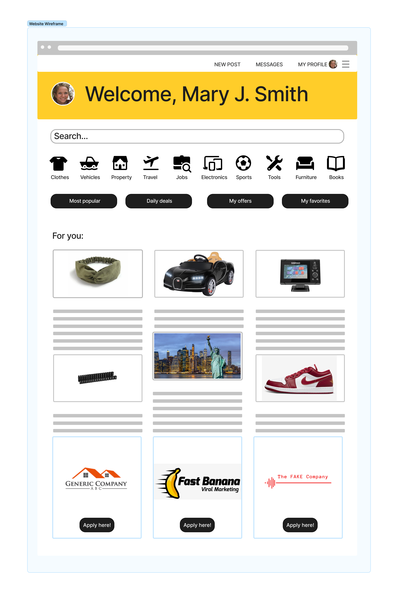

# GoodsList

Et repo som bruker modules-template som inneholder et javafx-prosjekt, med maven-oppsett for Java 18.0.1 og JavaFX 18.0.1, og JUnit 5 (Jupiter) og TestFX for testing.

Målet med dette prosjektet er å lage en applikasjon der brukere kan kjøpe og selge ting på nettet, tilsvarende finn.no eller craigslist.org. Det ferdige produktet bør ha full implementering av alle nødvendige funksjoner, inkludert et skybasert system som holder styr på klassifiserte annonser og et komplett brukerpåloggingssystem. Brukeren vil kunne opprette, administrere og se annonser samt kjøpe disse. Brukeren vil ha en oversikt over kjøpte og solgte annonser. Det vil også være mulig å sortere annonser på siden etter kategori (nyeste annonse vil komme øverst som standard).

## Klasse- og arkitekturdiagram 
[Architecture Diagram](/GoodsList/architectureDiagram.plantuml)
[Class Diagram](/GoodsList/classDiagram.plantuml)

## Brukerhistorie 1
Som bruker vil jeg opprette en bruker i denne applikasjonen, slik at jeg kan sjekke ut nettsiden.

**Viktig å kunne se**
- en innloggingside med muligheter for å logge inn, samt registrere en ny bruker
- endre scene etter man har logget inn til hovedsiden til appen

**Viktig å kunne gjøre**
- registrere bruker og logge inn
- trykke seg rundt på hovedsiden 

## Brukerhistorie 2
Som bruker vil jeg opprette en bruker i applikasjonen, slik at jeg kan legge ut noe for salg.

**Viktig å kunne se**
- en innloggingside med muligheter for å logge inn, samt registrere en ny bruker
- endre scene etter man har logget inn til hovedsiden til appen
- "New ad" knapp som tar deg til siden hvor man legger ut noe for salg
- ulike knapper for kategorier som tar deg til ulike sider med relevante inntastingsfelter for hver av disse kategoriene
- "Post for sale" knapp etter du har fått en preview av ad'en

**Viktig å kunne gjøre**
- registrere bruker og logge inn
- legge ut en ad for salg

## Brukerhistorie 3
Som bruker vil jeg se om det er noen bra produkter for hjemmet mitt på applikasjonen. 

**Viktig å kunne se**
- en liste av ad's på hovedsiden 
- preview av ad når du trykker inn på en
- "Buy now" knapp for en ad som ikke er din egen

**Viktig å kunne gjøre**
- sortere denne listen ved å trykke på kategorier eller skrive inn søkeord
- trykke inn på ad's i denne listen og velge om du vil kjøpe

## Illustrasjon
